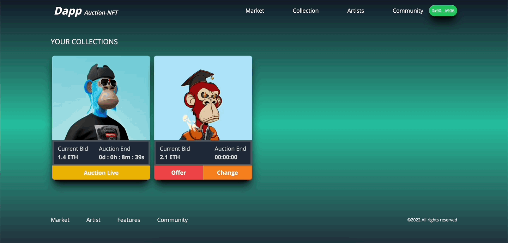
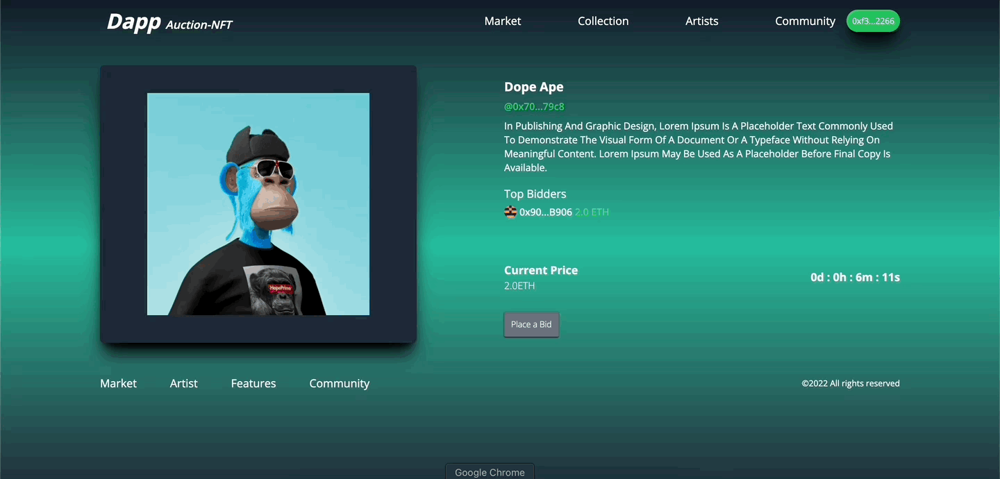

# How to Build an NFT Auction Site with React, Solidity, and CometChat

Read the full tutorial here: [**>> How to Build an NFT Auction Site with React, Solidity, and CometChat**](https://daltonic.github.io)

This example shows How to Build an NFT Auction Site with React, Solidity, and CometChat:



<center><figcaption>NFT Auction Marketplace: offerings</figcaption></center>



<center><figcaption>NFT Auction Marketplace: biddings</figcaption></center>

## Technology

This demo uses:

- Metamask
- Hardhat
- Alchamy
- Infuria
- ReactJs
- Tailwind CSS
- Solidity
- EthersJs
- Faucet

## Running the demo

To run the demo follow these steps:

1. Clone the project with the code below.

   ```sh

   # Make sure you have the above prerequisites installed already!
   git clone https://github.com/Daltonic/dappAuction
   cd dappAution # Navigate to the new folder.
   yarn install # Installs all the dependencies.
   ```

2. Create an Alchemy project, copy and paste your key in the spaces below.

3. Update the `.env` file with the following details.
   ```sh
   ENDPOINT_URL=<PROVIDER_URL>
   DEPLOYER_KEY=<YOUR_PRIVATE_KEY>
   ```

4. Head to [infuria](https://app.infura.io/dashboard) and create an IPFS project.

5. Create another `.env` file in the api directory and enter the following details.
   ```sh
   INFURIA_PID=<PROJECT_ID>
   INFURIA_API=PROJECT_API_SECRET>
   ```
6. Run the app using `yarn start`
   <br/>

If your confuse about the installation, check out this **TUTORIAL** to see how you should run it.

Questions about running the demo? [Open an issue](https://github.com/Daltonic/dappAution/issues). We're here to help ✌️

## Useful links

- 🏠 [Website](https://daltonic.github.io/)
- ⚽ [Metamask](https://metamask.io/)
- 🚀 [Remix Editor](https://remix.ethereum.org/)
- 💡 [Hardhat](https://hardhat.org/)
- ✨ [Infuria](https://infura.io/)
- 🔥 [ReactJs](https://reactjs.org/)
- 🐻 [Solidity](https://soliditylang.org/)
- 👀 [Ethersjs](https://docs.ethers.io/v5/)
- 🎅 [CometChat](https://try.cometchat.com/daltonic)
